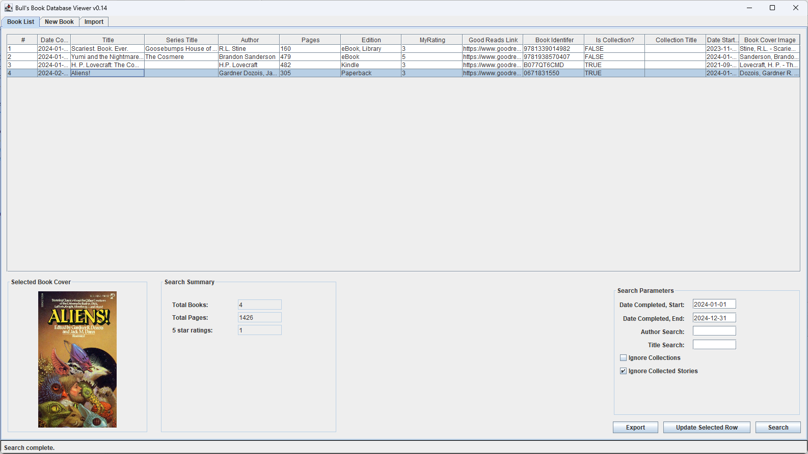

# Bull's Book Database Viewer

:cow: :books:

A database viewer for a PostgreSQL database of books read.

## Configuration file:

BBDBV will try to read a configuration file from the root named `BBDBV.ini`.

The login details should be in a section named `[login]`. Available settings are:
- `[url]` for the URL of the database
- `[user]` for the database login user name
- `[password]` for the database login password

The user details should be in a section named `[user]`. Available settings are:
- `[reader]` for the name of the reader.
- `[directory]` for the location of the book cover images.

## Book Cover Images:

A book cover image should be sorted into a subdirectory for the year that the book was completed. For example, `[directory]\2024\[filename]`

## Database

A PostgreSQL database can be created using the schema only backup included with the releases.

## Importing

Book lists can be imported from a tab separated value text file. Values should be in the following order:

* Number, Date Completed, Title, Series Title, Author, Edition, Pages, My Rating, Good Reads Link, Identifer, Is Collection?, Collection Title, Date Started, Image

A collection title string is interpreted as:
* string: The name of the book this story is a part of
* blank: Not a part of a collection

Lines in the imported file without a title will be ignored.

## Building:

To build from eclipse:

1. right click on the project and select Export.
2. Select Java->Runnable JAR file
3. Select "Package required libraries into generated JAR"

## Required libraries:

- [PostgreSQL JDBC Driver](https://jdbc.postgresql.org/) v42.7.1
- [ini4j](https://ini4j.sourceforge.net/) v0.5.5
